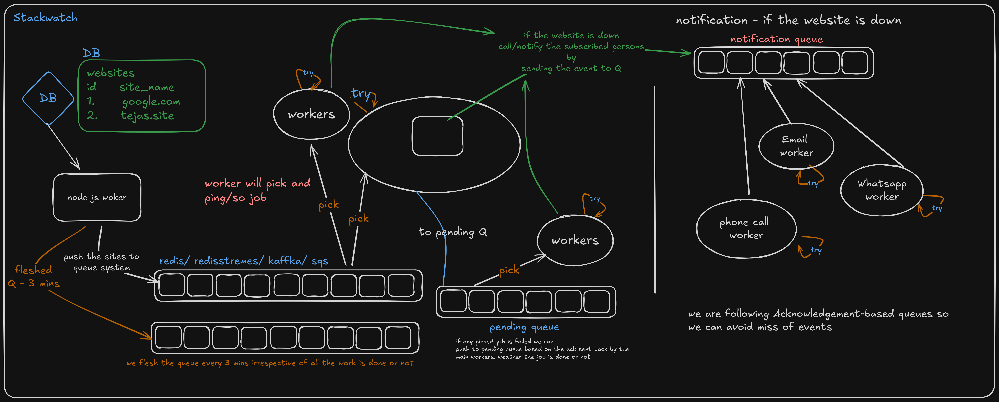

# StackWatch

StackWatch is an all-in-one observability platform inspired by **Better Stack** for monitoring logs, uptime, and application performance.

## 📦 Status

This project is currently under active development.

## 🎯 Goal

To build a production-ready observability platform while learning system monitoring, logging, and performance tracking.

## 🎯 Architecture

---

Inspired by [Better Stack](https://betterstack.com/)

## timeseries database

docker run -d -p 5435:5432 --name stackwatch-timescale -e POSTGRES_USER=tsdb -e POSTGRES_DB=metrics -e POSTGRES_PASSWORD=tsdb -v ts_data:/var/lib/postgresql/data timescale/timescaledb:latest-pg16
